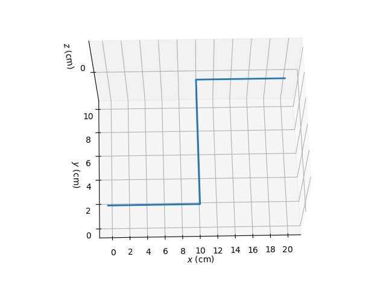
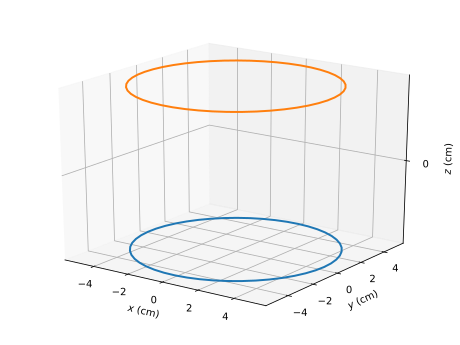
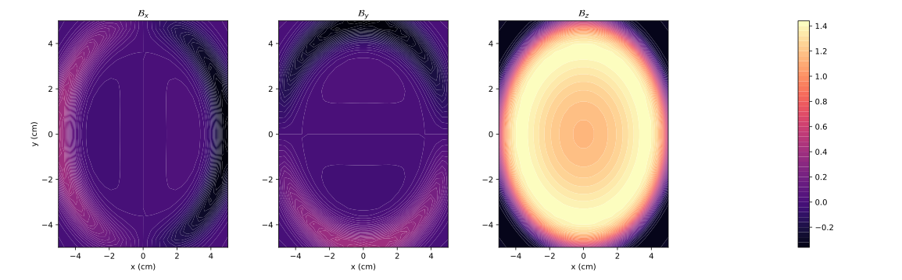

# Biot-Savart Magnetic Field Calculator

This tool numerically solves for the magnetic field around an arbitrarily shaped coil specified by the user, in a discrete and finite volume surrounding the coil.

Latest Version: V4.2 (June 19, 2020)

# Basic Overview of Functionality
Given an input coil, the tool can both calculate, and plot the magnetic field vector over a finite volume of space around the coil.

The coil is passed in as a set of vertices describing the geometry of the coil, as well as the amount of current flowing through a given segment of the coil. (See Formatting section)

A *target volume* is produced as a series of points within a rectangular prism bounding box around the coil. The magnetic field at each point in the target volume is evaluated, resulting in a 4D array of size (X, Y, Z, 3).

This target volume array can then be plotted using the built-in plotting function.


# Installation and Usage
### STAGE 1: Code Installation and Prerequisites
* Have Python 3.x installed
* Install `numpy` and `matplotlib`
* Clone or download the repository to your machine

### STAGE 2: Data Input and Calculating the Field

You can produce and calculate a target volume using `writeTargetVolume()`, which writes a calcualted target volume to a file which can be loaded and used later using `readTargetVolume(filename)`.

Parameters Breakdown
* `input_filename`: Name of input file. See **Coil Format** for details
* `output_filename`: The name of the file in which we store the finished target volume.
* `boxsize`: (x, y, z) tuple with the dimensions of the target volume in cm
* `startpoint`: (x, y, z) tuple representing the bottom left corner spatial position of the target volume (with respect to the coil) AKA the offset
* `coilresolution`: How long each discretized coil subsegment should be, in cm
* `volumeresolution`: Division of volumetric meshgrid (generate a point in the target volume every VolumeResolution cm)

Increasing `coilresolution` affects runtime linearly, whereas increasing `volumeresolution` increases runtime cubically.

`coilresolution` can be reduced to around 0.01 cm with acceptable results, and `volumeresolution` should be kept no lower than 0.1 cm. We recommend using 1 cm for both, if you can tolerate it.


#### Coil Format
The coil is represented as a series of (X,Y,Z) coordinates which define the vertices of the coil spatially, along with an additional coordinate (I) which defines the amount of current flowing from that vertex to the next one.

* Plaintext file
* The file contains each (X,Y,Z,I) entry on a new line
* The format of each line should be `"x,y,z,I\n"`

For instance:
```
0,0,1,2
0,1,1,3
1,1,1,4
```
Means that:
- There are 2 amps of current running between points 1 and 2
- There are 3 amps of current running between points 2 and 3
- The last bit of current is functionally useless.


An Example Coil (`coil.txt`):
```
0,0,0,1
10,0,0,1
10,10,0,1
20,10,0,1
```

Here's what the coil looks like (`coil.png`)




#### Understanding the Coordinate System and Indexing a Finished Target Volume
All positions in this program are described with respect to the position of the coil. This means, for the above coil, a `boxsize` of `(10, 10, 10)`, with a `startpoint` of `(-5, -5, -5)` creates a box with its middle centred about the first vertex of the coil at `(0, 0, 0)`. In other words, it's as you would expect.

When indexing a finished target volume, you must be wary of both the `volumeresolution` and the `startpoint`. For instance, a `volumeresolution` of 0.5 cm means that would would need to first subtract the starting point, and then multiply incoming coordinates by 2 to get the correct array index for the target volume.

### STAGE 3: Plotting
`plot_coil()` takes in an input filename for a coil stored in the format above, and graphs is in 3D.

`plot_fields()` produces contour plots of the Bx, By, and Bz components of the magnetic field along a certain plane.

Parameters Breakdown
* `Bfields`: a calculated target volume array, which can be read from `readTargetVolume()`
* `startpoint, box_size, vol_resolution`: Same as above
* `which_plane`: ['x', 'y', 'z'] the plane upon which you wish to graph
* `level`: the level of the plane on which you wish to graph (same coordinate system as the coil)
* `num_contours`: the number of contours produced

Example: Helmholtz Coil, plotted at z = 1.25



Results in a graph that looks like:




# Changelog
* v1: Initial Release

* v2: Code accelerated using numpy meshgrids
* v2.1: Tkinter dialogs for opening & saving files. Defaults of 1 cm resolution in calculation.
* v3: Plotting code integrated.
* v3.1: Minor cosmetic improvements to plot.
* v3.2: 3D plot of coil geometry.
* v3.3/3.4: Plotted B-fields together but code is long.
* v3.5/3.6: all B-field plots together
* v3.7: B-fields plotted together with 50 levels (now works on windows) and combined v3.3 and v3.5
* v3.8: Changed up all np.aranges to np.linspaces and changed up the plotting 
code to work with non-integer step sizes and non-integer levels
* v4: Using Richardson Extrapolation for midpoint rule to improve accuracy (5 to 30x better at 1.4x speed penalty), tweaked linspaces to correctly do step size
* v4.1: Minor change in function indexing to use more numpy, cleaning up for export
* v4.2: Changed the linspaces a bit to make everything more symmetric